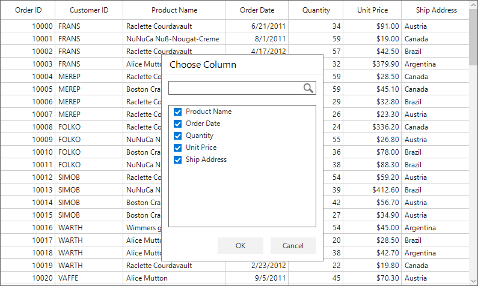

# How to avoid displaying specific columns from displaying in the column chooser?

This example illustrates how to avoid displaying specific columns from displaying in the column chooser

Columns visibility in the [WinForms DataGrid](https://www.syncfusion.com/winforms-ui-controls/datagrid) (SfDataGrid) can be changed at runtime by using the [ColumnChooserPopup](https://help.syncfusion.com/cr/windowsforms/Syncfusion.WinForms.DataGrid.Interactivity.ColumnChooserPopup.html) or [ColumnChooser](https://help.syncfusion.com/cr/windowsforms/Syncfusion.WinForms.DataGrid.Interactivity.ColumnChooser.html) control. By default, header text of all the columns in the DataGrid will be displayed in the ColumnChooser with checkboxes, we can uncheck/check those checkboxes to remove/add columns respectively. 
You can restrict some specific columns from displaying in the column chooser, so that those columns cannot be removed from the SfDataGrid.  This can be achieved by creating custom ColumnChooser and ColumnChooserPopup.

```c#

public class ColumnChooserPopupExt : Syncfusion.WinForms.DataGrid.Interactivity.ColumnChooserPopup
{
    private SfDataGrid DataGrid { get; set; }
    public ColumnChooserPopupExt(SfDataGrid sfDataGrid) : base(sfDataGrid)
    {
        this.Controls.Remove(this.ColumnChooser);
        DataGrid = sfDataGrid;
        ColumnChooser = new ColumnChooserExt(sfDataGrid);

        ////UnComment this if you want to close the popup when OK button is clicked
        //ColumnChooser.OKButton.Click += Close_ColumnChooserPopup;

        ColumnChooser.CancelButton.Click += Close_ColumnChooserPopup;
        ColumnChooser.BorderStyle = BorderStyle.None;
        ColumnChooser.ColumnChooserLabel.Visible = false;
        this.Controls.Add(ColumnChooser);
    }

    private void Close_ColumnChooserPopup(object sender, EventArgs e)
    {
        if (this.DataGrid.GetTopLevelParentDataGrid().FindForm() != null)
            this.DataGrid.GetTopLevelParentDataGrid().FindForm().Focus();
        this.Hide();
    }
}

public class ColumnChooserExt : Syncfusion.WinForms.DataGrid.Interactivity.ColumnChooser
{
    /// <summary>
    /// The grid attached with the column chooser.
    /// </summary>
    private SfDataGrid dataGrid;

    /// <summary>
    /// Initializes a new instance of the sfDataGrid
    /// </summary>
    /// <param name="sfDataGrid">The data grid which needs to be attached to the control.</param>
    public ColumnChooserExt(SfDataGrid sfDataGrid) : base(sfDataGrid)
    {
        dataGrid = sfDataGrid;
        dataGrid.Columns.CollectionChanged += Columns_CollectionChanged;
    }

    private void Columns_CollectionChanged(object sender, System.Collections.Specialized.NotifyCollectionChangedEventArgs e)
    {
        this.CheckedListBox.DataSource = dataGrid.Columns.Where(x => x.MappingName != "OrderID" && x.MappingName != "CustomerID");
    }

    protected override void AddCheckedListBox()
    {
        base.AddCheckedListBox();

        this.CheckedListBox.DataSource = dataGrid.Columns.Where(x => x.MappingName != "OrderID" && x.MappingName != "CustomerID");
    }

    protected override void OnSearchBoxTextChanged(object sender, EventArgs e)
    {
        base.OnSearchBoxTextChanged(sender, e);

        List<GridColumn> searchedItems = new List<GridColumn>();
        if (!string.IsNullOrEmpty(this.SearchTextBox.Text))
        {
            searchedItems.Clear();
            searchedItems = this.dataGrid.Columns.Where(item => (item.HeaderText.ToLower().Contains(this.SearchTextBox.Text.ToLower()) && item.MappingName != "OrderID" && item.MappingName != "CustomerID")).ToList();
            this.CheckedListBox.DataSource = null;
            this.CheckedListBox.DataSource = searchedItems;
        }
        else
            this.CheckedListBox.DataSource = dataGrid.Columns.Where(x => x.MappingName != "OrderID" && x.MappingName != "CustomerID");

        this.CheckedListBox.Invalidate();

    }
}

```



Take a moment to peruse the [WinForms DataGrid_ColumnChooser](https://help.syncfusion.com/windowsforms/datagrid/interactivefeatures#column-chooser) documentation, where you can find about Column Chooser, with code examples.

## Requirements to run the demo
Visual Studio 2015 and above versions

